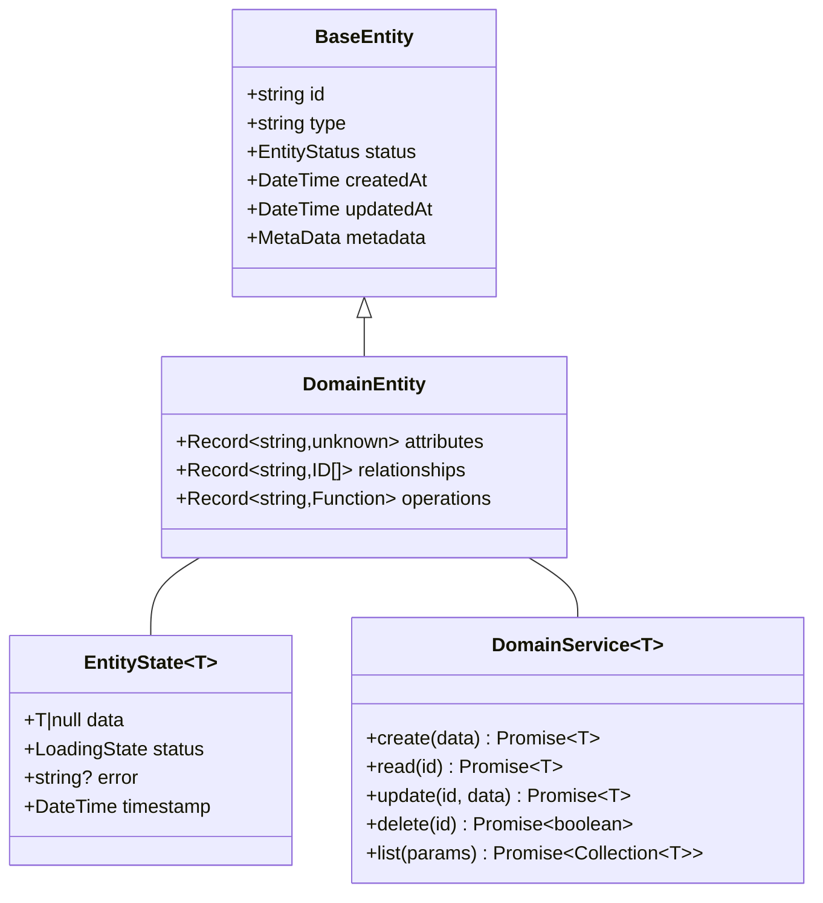

# Frontend Domain Model Template

## Overview

Defines the core concepts, entities, and rules that shape the frontend application's domain. This document serves as the foundation for implementing domain-driven design in the frontend.

## Domain Model Diagram

Visual representation of core entities and their relationships in the system.



## Core Types

Fundamental types and states used throughout the domain model.

```typescript
// Basic value types
type ID = string;
type DateTime = string;
type Status = string;
type EntityType = string;
type MetaData = Record<string, unknown>;

// Common states
type LoadingState = 'idle' | 'loading' | 'success' | 'error';
type EntityStatus = 'active' | 'inactive' | 'deleted';
```

## Domain Entities

Core business objects that represent the main concepts in the application.

### Base Entity

Common structure shared by all entities in the system.

```ts
interface BaseEntity {
  id: ID;
  type: EntityType;
  status: EntityStatus;
  metadata: MetaData;
  createdAt: DateTime;
  updatedAt: DateTime;
}
```

### Primary Entities

Main business entities that drive the application's functionality.

```ts
interface DomainEntity extends BaseEntity {
  attributes: Record<string, unknown>;
  relationships: Record<string, ID | ID[]>;
  operations: Record<string, (...args: unknown[]) => unknown>;
}
```

### Entity States

Patterns for managing entity loading and collection states.

```ts
interface EntityState<T> {
  data: T | null;
  status: LoadingState;
  error?: string;
  timestamp: DateTime;
}

interface CollectionState<T> {
  items: T[];
  status: LoadingState;
  pagination: {
    page: number;
    pageSize: number;
    total: number;
  };
  filters: Record<string, unknown>;
}
```

## Domain Events

Events that represent important changes in the system state.

```ts
interface DomainEvent {
  type: string;
  payload: unknown;
  metadata: {
    timestamp: DateTime;
    actor: ID;
    context: string;
  };
}
```

## Domain Services

Service interfaces that define the operations available on domain entities.

```ts
interface DomainService<T extends BaseEntity> {
  create(data: Partial<T>): Promise<T>;
  read(id: ID): Promise<T>;
  update(id: ID, data: Partial<T>): Promise<T>;
  delete(id: ID): Promise<boolean>;
  list(params: QueryParams): Promise<CollectionState<T>>;
}

interface QueryParams {
  filters?: Record<string, unknown>;
  sort?: {
    field: string;
    order: 'asc' | 'desc';
  };
  pagination?: {
    page: number;
    pageSize: number;
  };
}
```

## Business Rules

Core rules and constraints that govern the behavior of domain entities.

### Entity Rules

Rules that define valid entity states and relationships.

- Required fields
- Validation rules
- State transitions
- Relationship constraints

### Operation Rules

Rules that govern how entities can be manipulated.

- Access controls
- Business constraints
- Validation requirements
- Operation limits

### State Rules

Rules for managing entity state changes and caching.

- Valid state transitions
- State dependencies
- Concurrent operations
- Cache invalidation

### Implementation Guidelines

Practical guidelines for implementing the domain model.

### Type Safety

Ensuring type correctness throughout the application.

- Use strict typing
- Define clear interfaces
- Document type constraints
- Handle edge cases

### State Management

Patterns for managing application and entity state.

- Define clear states
- Handle loading states
- Manage error states
- Cache considerations

### Data Flow

Patterns for data movement through the application.

- Entity relationships
- Event propagation
- State updates
- Error handling

### References

Supporting documentation and resources.

- Domain documentation
- API specifications
- Business requirements
- Technical constraints
